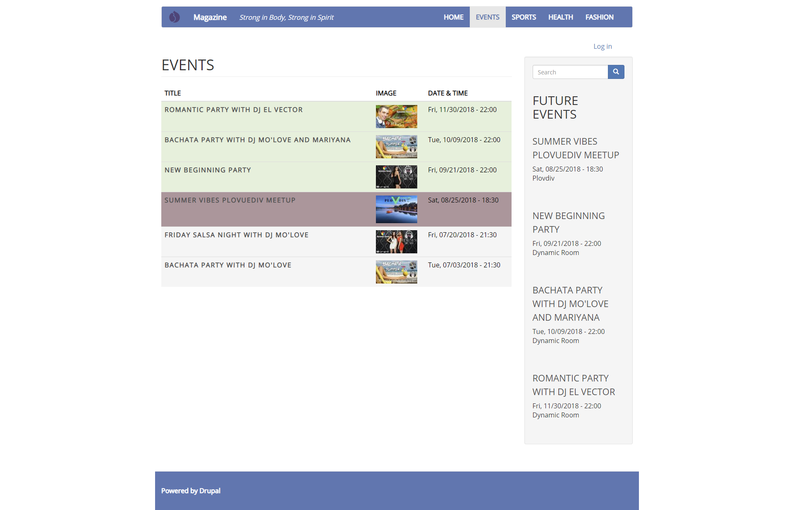
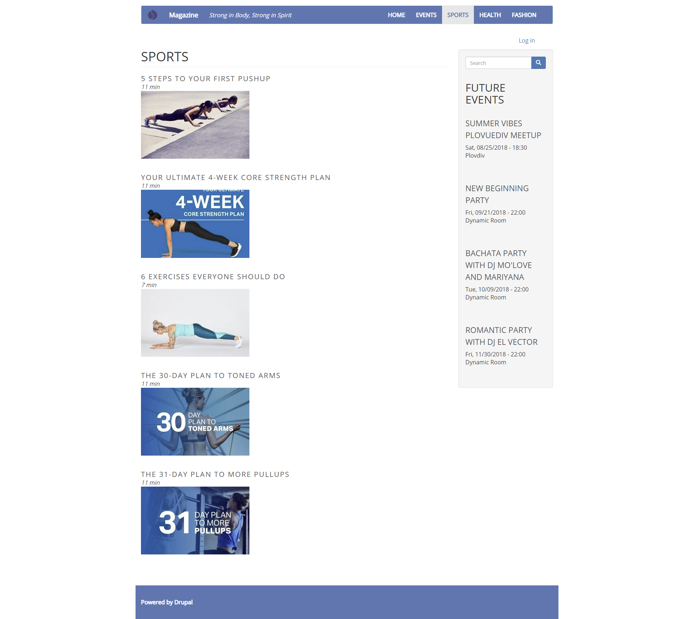
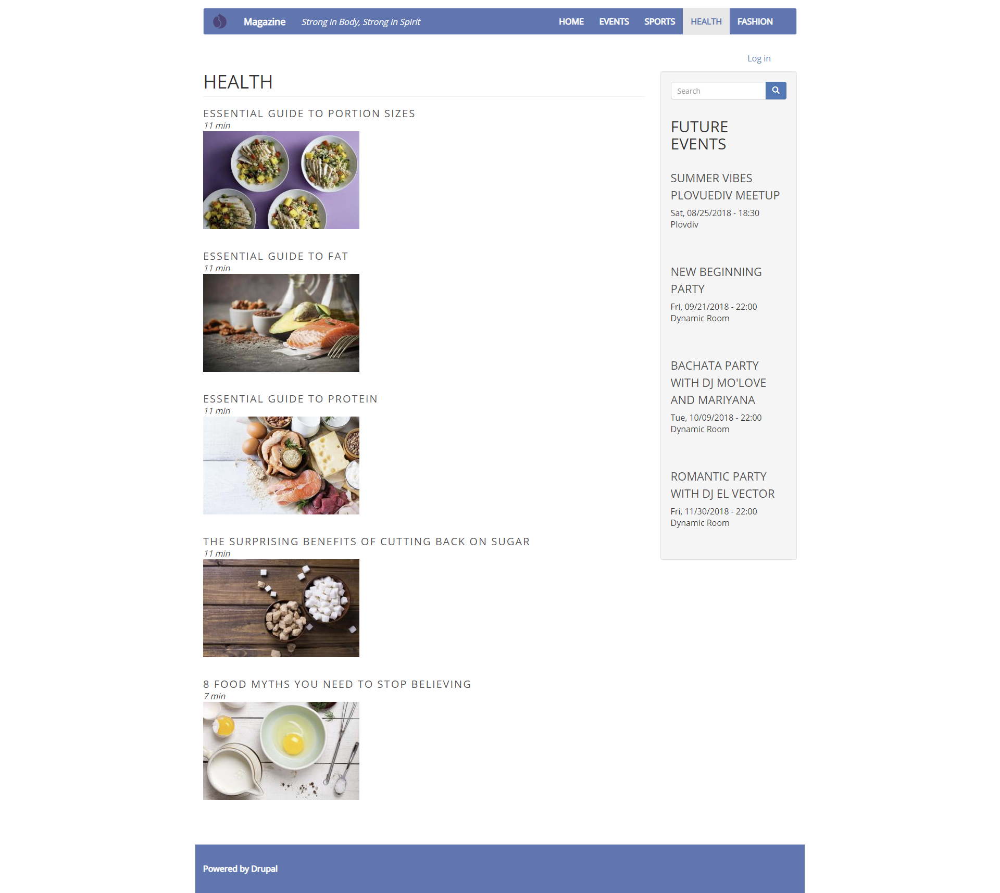
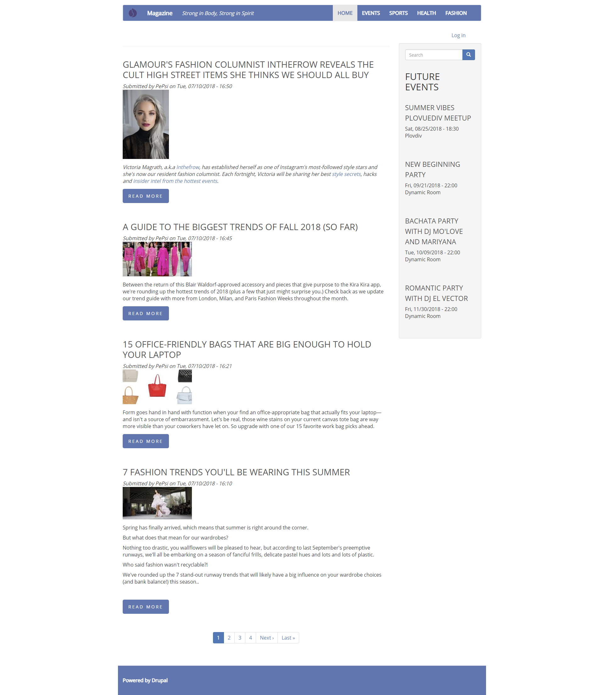
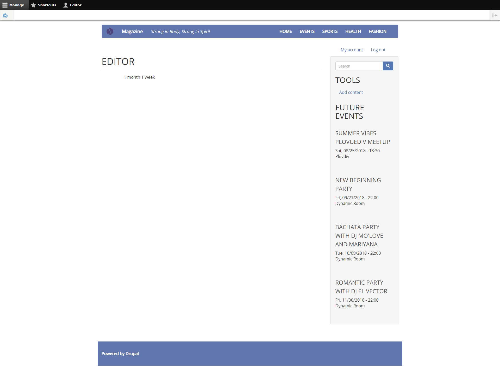
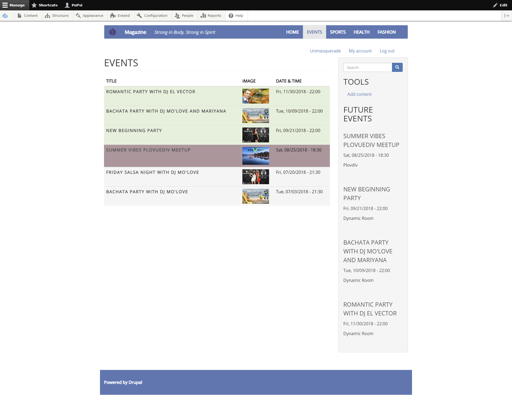

# Site Strong Infinity Drupal 8

**Site Strong Infinity Drupal 8** is a fully working magazine Drupal website (for publishing articles and events) with:
* home page showing the latest articles of all categories;
* another page displaying latest events;
* a separate page for each article’s category – Sports, Health, Fashion.

I have created a custom theme [**Strong Infinity**](custommagazinedrupal-8.5.5/themes/custom/stronginfinity "The source code of My custom theme") using: **Drupal 8, Acquia Dev Desktop 2, JavaScript, jQuery, CSS3**.

The header includes: Logo, Name, Slogan, Home page, Events page and 3 pages for the categories (Sports, Health, Fashion). 

## Description

#### **Task Part I:** [Full description of part I of the task](/documents/site-building-task.pdf)
1. Installed Drupal 8.
    
2. Installed and enabled the Admin Toolbar module.

3. Choosed, installed and enabled a theme from drupal.org.

4. Created and modified content types: Article and Event. (Used taxonomy to categorize pieces of content.)
   * Changed the Article content type. Reused some of the existing fields, deleted the unnecessary ones and added new, so that the Article content type ends up with the following fields:
     + Title;
     + Reading Time;
     + Image;
     + Content (edited the existing Body field and changed its label from "Body" to "Content");
     + Category – a reference field pointing to a vocabulary. Added a new Vocabulary (Article Category) and added terms to the vocabulary (Sports, Health, Fashion) in advance. Maked the Category field a select list.
     
    
    
   * Added a new content type Event. Reused some of the existing fields, deleted the unnecessary ones and added new, so that the Event content type ends up with the following fields:
     + Title;
     + Image;
     + Date & Time (used the default Date field);
     + Description (edited the existing Body field and changed its label from "Body" to "Description");
     + Location – the address of the event.
     
        
    
   * Reordered the fields for both content types as listed above, choosed an appropriate widget from the Manage Form Display for the edit page. Reordered them and hided the unnecessary labels from the Manage display for the actual page seen by the end user.

5. Builded category pages via Views module:
   * Events => path: /events. Get only Title, Image and Date fields. Sort the events by Date field – the most recent one should be at the top.
     + On 22.08.2018 Events Page looked like this:
     
       
   * Sports, Health and Fashion => Fetch only articles of current category. Get only the Title, Reading Time and Image fields. Sort the articles by Content: Authored On. The latest articles should be displayed at the top.
     + Sports Page looks like this:
     
       
     + Health Page looks like this:
     
       
     + Fashion Page looks like this:
     
       

6. Changed the Frontpage Views page so that it displays only content of type Article.
   

7. Edited the main menu and added new menu links for the pages created via Views. Changed the weight so that they appear in the following order: Home, Events, Sports, Health, Fashion.

8. Add a new user role “Editor” with limited permissions. The editor is able to create, edit and delete his/her own content (Articles, Events and Pages).
   * Log in:
   
     
   * Editor:  
   
     

9. Installed, enabled & configured the Pathauto module for user-friendly URLs: https://www.drupal.org/project/pathauto.

10. Added the “Powered by Drupal” block to the Footer region of my website.

11. Created and published real content: 5 articles per each category and 5 events.

#### **Task Part II:**

12. Created a custom theme - Strong Infinity:
    

13. Created different styles for the Events table:

    * green - for the future events (after 22.08.2018);
    * red - for the closest event (to 22.08.2018);
    * grey - for the previous events (before 22.08.2018).
    
    Events Page looks like this for `user #1` or `/user/1` or `The superuser` (who sets up the Drupal site and has full access):
    
      
	  
14. Added Slogan (Strong in Body, Strong in Spirit).

15. Updated Structure.

16. Created Image style for the Article categories pages.

17. Created Sidebar Search.

18. Created sidebar events, named Future Events, showed in descending order (from the closest event to the current date - 22.08.2018). 

## My solution - Explanation

* [Part I](/documents/Solution%20Part%201%20-%20Magazine%20website%20-%20my%20first%20Drupal%20website.docx)
* [Part II](/documents/Solution%20Part%202%20-%20Custom%20Site%20Strong%20Infinity.docx)
   
## [More Screenshots of My Site](screenshots/)

**Originally developed by:**
* Petya Kostova => [petyakostova](https://github.com/petyakostova)

**The Game is licensed under the GNU General Public License v3.0**
